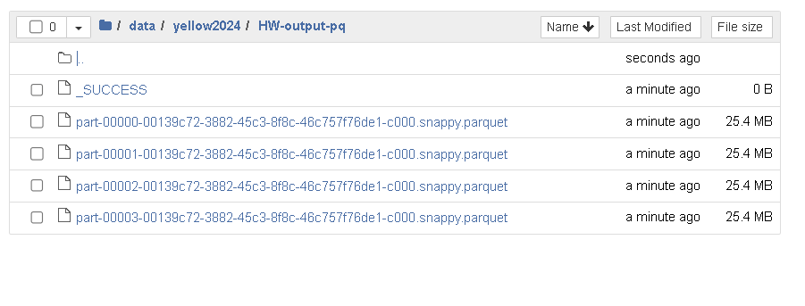

# Module 5 Homework

In this homework we'll put what we learned about Spark in practice.

For this homework we will be using the Yellow 2024-10 data from the official website: 

```bash
wget https://d37ci6vzurychx.cloudfront.net/trip-data/yellow_tripdata_2024-10.parquet
```


## Question 1: Install Spark and PySpark

- Install Spark
- Run PySpark
- Create a local spark session
- Execute spark.version.

What's the output?

> [!NOTE]
> To install PySpark follow this [guide](https://github.com/DataTalksClub/data-engineering-zoomcamp/blob/main/05-batch/setup/pyspark.md)
>
```
import pyspark
from pyspark.sql import SparkSession
spark = SparkSession.builder \
    .master("local[*]") \
    .appName('test') \
    .getOrCreate()

spark.version
```
## Answer: '3.3.2'

## Question 2: Yellow October 2024

Read the October 2024 Yellow into a Spark Dataframe.
* Data Downloaded
```bash
!wget https://d37ci6vzurychx.cloudfront.net/trip-data/yellow_tripdata_2024-10.parquet
```
* Data Read
```
DY_1024 = spark.read.parquet('yellow_tripdata_2024-10.parquet')
```
Repartition the Dataframe to 4 partitions and save it to parquet.
```
DY_1024.repartition(4).write  \
    .mode("overwrite").parquet("./yellow2024/HW-output-pq/")
```
What is the average size of the Parquet (ending with .parquet extension) Files that were created (in MB)? Select the answer which most closely matches.

- 6MB
- 25MB
- 75MB
- 100MB
## Answer: 25MB


## Question 3: Count records 

How many taxi trips were there on the 15th of October?

Consider only trips that started on the 15th of October.

- 85,567
- 105,567
- 125,567
- 145,567

* Solution:   First temp table created
```
  DY_1024.registerTempTable('yellow1024')
```
Query with spark-sql
```
spark.sql("""
SELECT
    count(*)as total_trips
FROM
    yellow1024
WHERE 
    to_date(tpep_pickup_datetime)= '2024-10-15';
""").show()

Answer:
[Stage 88:>                                                         (0 + 4) / 4]
+-----------+
|total_trips|
+-----------+
|     128893|
+-----------+


[Stage 88:===========================================>              (3 + 1) / 4]
------------------------------------------------------------------------
# pyspark code

DY_1024 \
    .withColumn('pickup_date', F.to_date(DY_1024.tpep_pickup_datetime)) \
    .filter("pickup_date = '2024-10-15'") \
    .count()

Answer:
128893
```
## Answer: 125,567 ( close to answer)

## Question 4: Longest trip

What is the length of the longest trip in the dataset in hours?

- 122
- 142
- 162
- 182
* Solution:
```
  # pyspark code
 DY_1024 \
    .withColumn('duration', DY_1024.tpep_dropoff_datetime.cast('long') - DY_1024.tpep_pickup_datetime.cast('long')) \
    .withColumn('duration_hours', (DY_1024.tpep_dropoff_datetime.cast('long') - DY_1024.tpep_pickup_datetime.cast('long')) / 3600) \
    .withColumn('pickup_date', F.to_date(DY_1024.tpep_pickup_datetime)) \
    .groupBy('pickup_date') \
        .agg(
            F.max('duration').alias('max_duration'),
            F.max('duration_hours').alias('max_duration_hours')
        ) \
    .orderBy('max_duration', ascending=False) \
    .limit(5) \
    .show()

Answer:
+-----------+-------------+-----------------+
|pickup_date|max_duration| max_duration_hours|
+-----------+------------+------------------+
| 2024-10-16|      585424|         162.62    |
| 2024-10-03|      515970|         143.33    |
| 2024-10-22|      495938|         137.76    |
| 2024-10-18|      413405|         114.83    |
| 2024-10-21|      323634|           89.9    |
+------------+------------+------------------+

---------------------------------------------------------------------------------------------------------------------------
# spark-sql
spark.sql("""
    WITH duration_data AS (
        SELECT *, 
               CAST(tpep_dropoff_datetime AS LONG) - CAST(tpep_pickup_datetime AS LONG) AS duration, 
               TO_DATE(tpep_pickup_datetime) AS pickup_date
          FROM yellow1024
    ) 
    SELECT pickup_date, 
           ROUND(MAX(duration)/3600,2) AS max_duration
      FROM duration_data
    GROUP BY pickup_date
    ORDER BY max_duration DESC
    LIMIT 5;
""").show()

Answer:
+-----------+----------------+
|pickup_date|max_duration    |
+-----------+----------------+
| 2024-10-16|      162.62    |
| 2024-10-03|      143.33    |
| 2024-10-22|      137.76    |
| 2024-10-18|      114.83    |
| 2024-10-21|        89.9    |
+-----------+----------------+
```
## Answer: 162

## Question 5: User Interface

Spark’s User Interface which shows the application's dashboard runs on which local port?

- 80
- 443
- 4040
- 8080

## Answer: Spark UI port: 4040

## Question 6: Least frequent pickup location zone

Load the zone lookup data into a temp view in Spark:

```bash
wget https://d37ci6vzurychx.cloudfront.net/misc/taxi_zone_lookup.csv
```

Using the zone lookup data and the Yellow October 2024 data, what is the name of the LEAST frequent pickup location Zone?

- Governor's Island/Ellis Island/Liberty Island
- Arden Heights
- Rikers Island
- Jamaica Bay
  
* Solution
```
df_zones = spark.read.parquet('/home/suman/batch-pyspark/zones')
df_zones.registerTempTable('zones')

# spark-sql
spark.sql("""
    SELECT
        CONCAT(zp.Zone, ' / ', zd.Zone) AS PickUp_DropOff_Location,
        COUNT(1) AS trip_count
    FROM 
        yellow1024 y
        LEFT JOIN zones zp ON y.PULocationID = zp.LocationID
        LEFT JOIN zones zd ON y.DOLocationID = zd.LocationID
    GROUP BY 
        PickUp_DropOff_Location
    ORDER BY 
        trip_count
    LIMIT 5;
""").show()
[Stage 76:>                                                         (0 + 4) / 4]

[Stage 76:==============>                                           (1 + 3) / 4]
+-----------------------+----------+
|PickUp_DropOff_Location|trip_count|
+-----------------------+----------+
|   Borough Park / Pe...|         1|
|   Melrose South / H...|         1|
|   Bay Ridge / Green...|         1|
|   East Tremont / St...|         1|
|   East Harlem South...|         1|
+-----------------------+----------+
------------------------------------------------------------------------------------------------------------
# pyspark code

# Join df_yellow_2024 with zones for pickup and drop-off locations
df_joined = DY_1024 \
    .join(df_zones.alias("zp"), DY_1024.PULocationID == F.col("zp.LocationID"), "left") \
    .join(df_zones.alias("zd"), DY_1024.DOLocationID == F.col("zd.LocationID"), "left")
          
# Concatenate Zone names for pickup and drop-off locations
df_with_location = df_joined.withColumn(
    "PickUp_DropOff_Location",
    F.concat(F.col("zp.Zone"), F.lit(" / "), F.col("zd.Zone"))
)          
# Group by the concatenated pickup and drop-off location, and count trips
df_grouped = df_with_location.groupBy("PickUp_DropOff_Location").agg(
    F.count("*").alias("trip_count")
)   
 # Order by trip_count in descending order and limit to top 5
df_least5 = df_grouped.orderBy(F.col("trip_count").asc()).limit(5)

# Show the results
df_least5.show()

Answer:
[Stage 81:==============>                                           (1 + 3) / 4]
+-----------------------+----------+
|PickUp_DropOff_Location|trip_count|
+-----------------------+----------+
|   Borough Park / Pe...|         1|
|   Melrose South / H...|         1|
|   Bay Ridge / Green...|         1|
|   East Tremont / St...|         1|
|   East Harlem South...|         1|
+-----------------------+----------+

